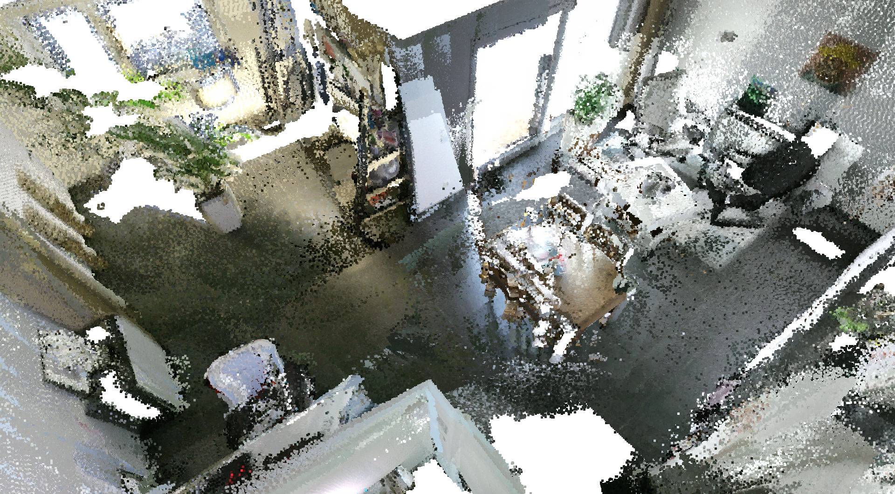
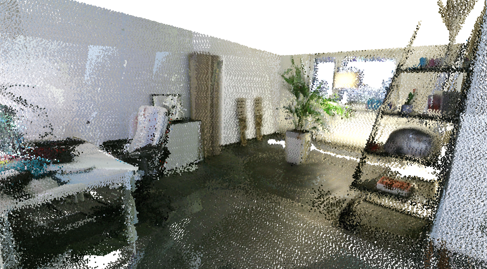
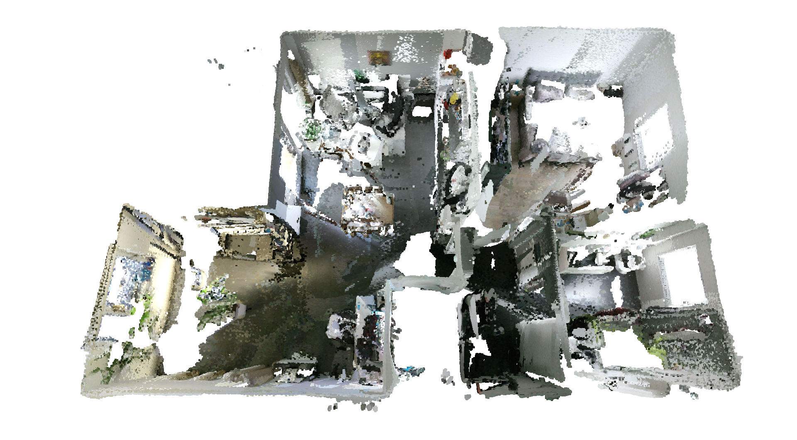
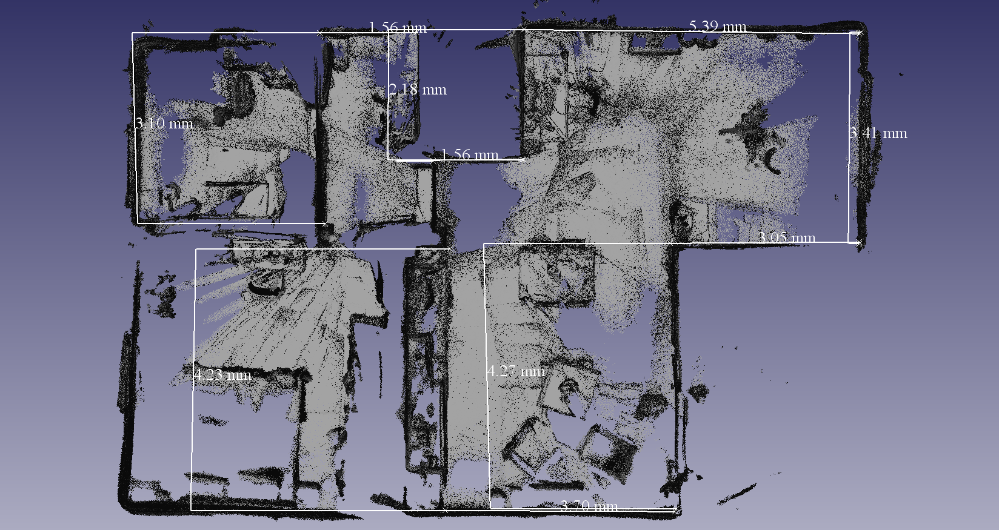

# FlatScan
Creating a 3D Model of my current flat for fun and profit.

## Setup
### Microsoft Kinectv2
The RGB-D data is recorded using a Kinectv2.
The model used here has the following intrinsic parameters:
	fx, fy, cx, cy, k1, k2, k3
	(366.78, 366.78, 258.60, 203.27, 0.09, -0.27, 0.098)

### ORBSLAM2
ORBSLAM2 is used to extract a trajectory out of the data. 
This trajectory relates the individual frames to each other by calculating a transformation from each frame to the next. 
After that, the individual frames can be converted to pointclouds and reprojected into common reference frame.

## Results
### Qualitative
The follow images show that flat has indeed been scanned.

### Distance Validation
Next the results are compared to manually taken measurements to check if the 
absolute scales are correct.

3D Scan:

manually measured ground truth:

The measurements are reasonably close to the ground truth, showing differences up to 15 cm.
The difference can be explained by two factors. Firstly, there is visibile noise in the generated map. Secondly, the ground truth was measured manually using a measuring stick, which also introduces measurement error.